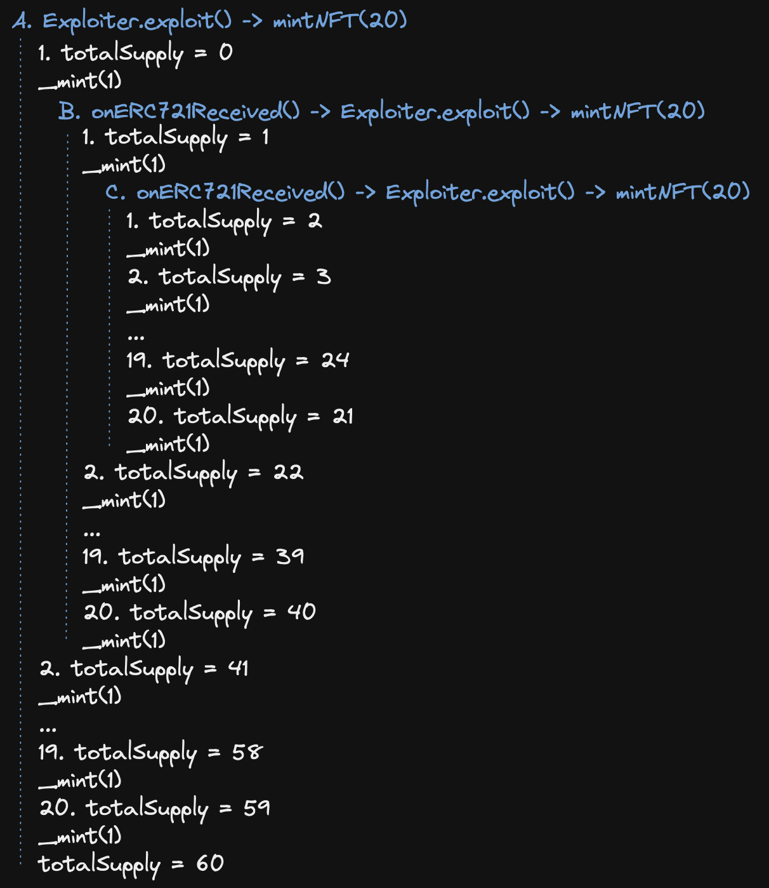

# Hashmasks Exploit

This repo is meant to recreate the Hashmasks re-entrancy attack in order to have a simple Foundry based testing framework for this attack vector that can be used on future NFT projects. The re-entrancy attack vector results in total mints far exceeding supply; however, the attacker still must pay for the entire mint quantity.

@samczsun & hashmasks wrote-up the original reports [here](https://samczsun.com/the-dangers-of-surprising-code) and [here](https://thehashmasks.medium.com/hashmask-art-sale-bug-report-13ccd66b55d7)

## Background

`src/Masks.sol` is a simplified copy of the [original Hashmasks contract](https://etherscan.io/address/0xc2c747e0f7004f9e8817db2ca4997657a7746928#code). One major change was the addition of the `fixedMint` function, which is meant to demonstrate the proper mitigation for this attack. We also reduced the `MAX_NFT_SUPPLY` for simplicity.

`src/Exploiter.sol` is a custom exploit contract used to execute the re-entrancy attack vector

`test/Masks.t.sol` tests the attack vector and demonstrates the mitigation via `fixedMint`

The tests can be run with `forge test`

## Learnings

### what's actually wrong with the iterator?

The `mintNFT` function includes two max supply checks that at first glance would appear to prevent the contract from ever exceeding max supply:

```solidity
require(totalSupply < MAX_NFT_SUPPLY, "Sale has already ended");
require(totalSupply + numberOfNfts <= MAX_NFT_SUPPLY, "Exceeds MAX_NFT_SUPPLY");
```

However, these checks occur before the `_safeMint()` iteration. The contract only evaluates the require statements one time per `mintNFT` call and then since each `mintNFT` function call allows the user to mint up to 20 additional tokens the contract is re-entered 19 additional times per require evaluation.

The simplest example is if we re-enter 2 times, which would mean `mintNFT(20)` is called 3 times. This means the `totalSupply` require checks are evaluated at totalSupply 0, 1 & 2, but ultimately the attacker mints 60 tokens. The below graphic demonstrates:



### `onERC721Received` callback can re-enter the mintNFT function. Reverts will revert EVERYTHING

Of note, `test_ExploitFixed` proves that the re-entrancy is all one transaction & if it hits a revert all the mints will rollback. In the case of `test_ExploitFixed` the user will only be able to mint the `MAX_NFT_SUPPLY` = 25, but the additional re-entrancies attempt to keep minting above the MAX, as a result all the mints fail, the entire transaction rollsback ultimately the contract is left at a totalSupply of 0... as if nothing ever happened

## Foundry setup for posterity

```sh
forge install --no-commit PaulRBerg/prb-test@0.3.1
forge install transmissions11/solmate
forge install OpenZeppelin/openzeppelin-contracts
forge install foundry-rs/forge-std
```
